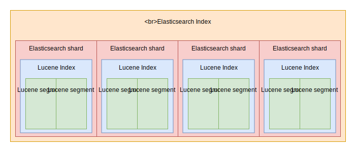

```
WIP, COVERS ELASTICSEARCH 5.5.x, UPDATING TO ES 6.5.x
```

# A few things you need to know about Lucene

Before you start to think about choosing the right hardware, there are a few things you need to know about [Lucene](http://lucene.apache.org/).

Lucene is the name of the search engine that powers Elasticsearch. It is an open source project from the Apache Foundation. There's no need to interact with Lucene directly, at least most of the time, when running Elasticsearch. But there's a few important things to know before choosing the cluster storage and file system.

## Lucene segments

Each Elasticsearch index is divided into shards. Shards are both logical and physical divisions of an index. Each Elasticsearch shard is a Lucene index. The maximum number of documents you can have in a Lucene index is 2,147,483,519. The Lucene index is divided into smaller files called segments. A segment is a small Lucene index. Lucene searches in all segments sequentially.



Lucene creates a segment when a new writer is opened, and when a writer commits or is closed. It means segments are immutable. When you add new documents into your Elasticsearch index, Lucene creates a new segment and writes it. Lucene can also create more segments when the indexing throughput is important.

From time to time, Lucene merges smaller segments into a larger one. the merge can also be triggered manually from the Elasticsearch API.

This behavior has a few consequences from an operational point of view.

The more segments you have, the slower the search. This is because Lucene has to search through all the segments in sequence, not in parallel. Having a little number of segments improves search performances.

Lucene merges have a cost in terms of CPU and I/Os. It means they might slow your indexing down. When performing a bulk indexing, for example an initial indexing, it is recommended to disable the merges completely.

If you plan to host lots of shards and segments on the same host, you might choose a filesystem that copes well with lots of small files and does not have an important inode limitation. This is something we'll deal in details in the part about choosing the right file system.

## Lucene deletes and updates

Lucene performs copy on write when updating and deleting a document. It means the document is never deleted from the index. Instead, Lucene marks the document as deleted and creates another one when an update is triggered.

This copy on write has an operational consequence. As you'll update or delete documents, your indices will grow on the disk unless you delete them completely. One solution to actually remove the marked documents is to force Lucene segments merges.

During a merge, Lucene takes 2 segments, and moves the content into a third, new one. Then the old segments are deleted from the disk. It means Lucene needs enough free space on the disk to create a segment the size of both segments it needs to merge.

A problem can arise when force merging a huge shard. If the shard size is \> half of the disk size, you provably won't be able to fully merge it, unless most of the data is made of deleted documents.
