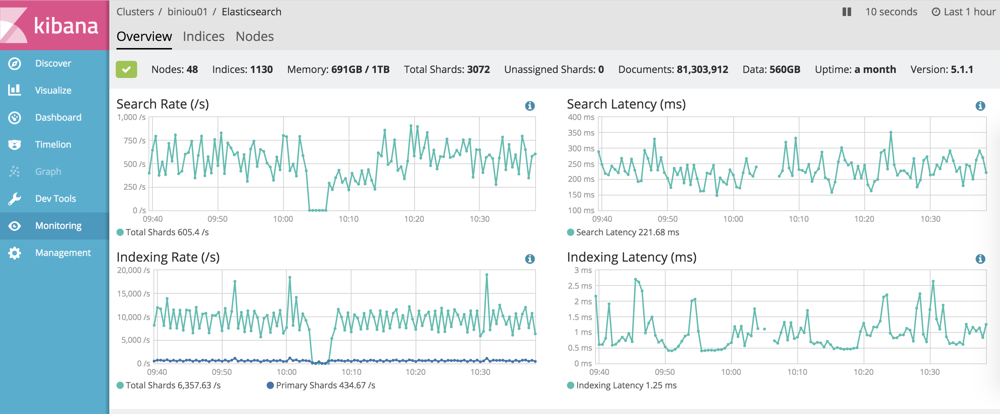
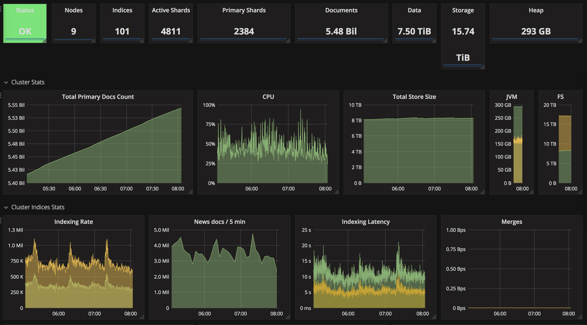
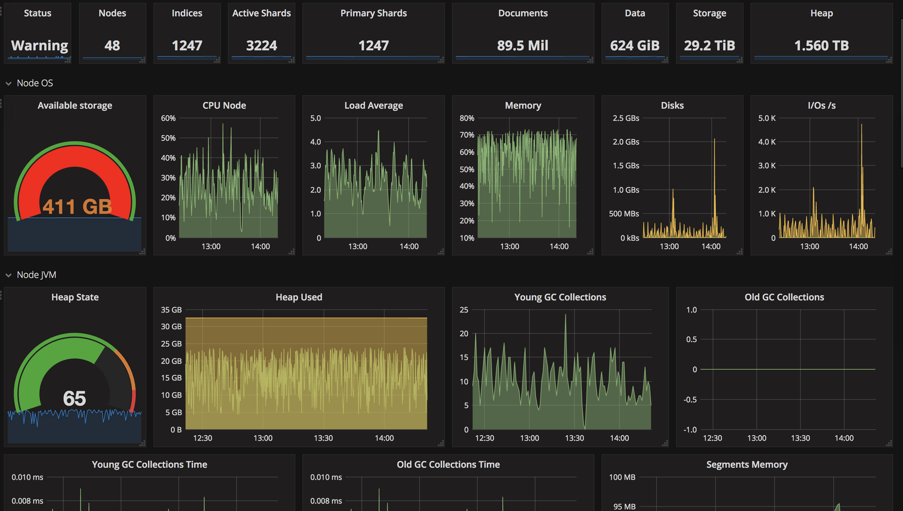

```
WIP, COVERS ELASTICSEARCH 5.5.x
```

# Monitoring Elasticsearch

Is your cluster healthy for real?

Monitoring Elasticsearch is the most important and most difficult part of deploying a cluster. The elements to monitor are countless, and not all of them are worth raising an alert. There are some common points though, but the fine monitoring really depends on the workload and use you need.

This chapter is divided into 3 different parts, covering the 3 most important environments to monitor:

* monitoring at the cluster level,
* monitoring at the host level,
* monitoring at the index level.

Each parts extensively covers the critical things to have a look at, and gives you an overview to the little thing that might be worse checking when troubleshooting.

## Tools

Elastic provides an extensive monitoring system through the X-Pack plugin. X-Pack has a free license with some functional limitations. The free license only lets you manage a single cluster, a limited amount of nodes, and has a limited data retention. X-Pack documentation is available at [https://www.elastic.co/guide/en/x-pack/index.html](https://www.elastic.co/guide/en/x-pack/index.html)



I have released 3 Grafana dashboards to monitor Elasticsearch Clusters using the data pushed by the X-Pack monitoring plugin. They provide much more information that the X-Pack monitoring interface, and are meant to be used when you need to gather data from various sources. They are not meant to replace X-Pack since they don't provide security, alerting or machine learning feature.

Monitoring the at the cluster level: [https://grafana.com/dashboards/3592](https://grafana.com/dashboards/3592)



Monitoring at the node level: [https://grafana.com/dashboards/3592](https://grafana.com/dashboards/3592)



Monitoring at the index level: [https://grafana.com/dashboards/3592](https://grafana.com/dashboards/3592)


These dashboards are meant to provide a look at everything Elasticsearch sends to the monitoring node. It doesn't mean you'll actually need these data.

## Monitoring at the host level

TODO

## Monitoring at the node level

TODO

## Monitoring at the cluster level

TODO

## Monitoring at the index level

TODO
