# Use Cases

TODO: spllit, clean and rewrite

## Migrating a Cluster Across the Ocean Without Downtime

I had to migrate a whole cluster from Canada to France without downtime.

With only 1.8TB of data, the cluster was quite small. However, crossing the ocean on an unreliable network made the process long and hazardous.

My main concern was about downtime: it was not an option. Otherwise I would have shutdown the whole cluster, rsync the data and restarted the Elasticsearch processes.

To avoid downtime, I decided to connect both clusters and rely on Elasticsearch elasticity. It was made possible because this (rather small) cluster relied on unciast for discovery. With unicast discovery, you add a list of node in your Elasticsearch configuration, and you let it discover his pairs. This is something I did once, but not cross continent!

First step was to connect both clusters using unicast. To do this, I've added the IP address of the Canadian master nodes to one of the French cluster nodes configuration. I updated both machines firewall rules to they were able to communicate on port 9300, then restarted the Elasticsearch process.

At first, I only launched one French node, the one I planned to communicate with the Canadian one as a gateway. After a few hours of shard relocation, everything was green again, and I just I was able to shutdown the first Canadian data node.

That's what I launched the 2 other French nodes. They only knew about each other and the *gateway* node. They did not know anything about the Canadian ones, but it worked like a charm.

If for some reasons you can't expose your new Elasticsearch cluster, what you can do is adding a http only node you will use as a bridge. Just ensure it can communicate with both clusters by adding 1 IPs of each of their nodes, it works quite well, even with 1 public and 1 private subnets. This gateway provides another advantage: you don't need to update your clusters configuration to make them discover each other.

Once again, it took a few hours to relocate the shards within the cluster, but it was still working like a charm, getting his load of reads and writes from the application.

Once the cluster was all green, I could shutdown the second Canadian node, then the third after some relocation madness.

You may have noticed that at that time, routing nodes were still in Canada, and data in France.

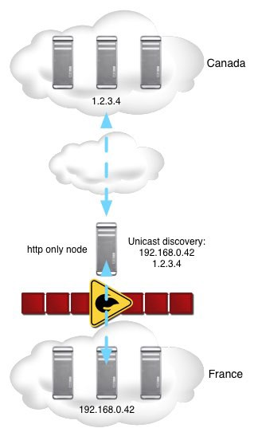 

That's right. The latest part of it was playing with DNS.


The main ES hostname the application accesses is managed using Amazon Route53. Route53 provides some nice round robin thing so the same A record can point on many IPs or CNAME with a weight system. It's pretty cool even though it does not provide failover. If one of your nodes crash, it needs to unregister itself from route53.

As soon as the data transfer was OK, I was able to update route53, adding 3 new records to route53. Then, I deleted the old records and removed the routing nodes from the cluster. Mission successful.

## An Advanced Elasticsearch Architecture for High-volume Reindexing

I've found a new and funny way to play with [Elasticsearch](http://elastic.co/) to reindex a production cluster without disturbing our clients. If you haven't already, you might enjoy what we did last summer [reindexing 36 billion documents in 5 days within the same cluster](https://thoughts.t37.net/how-we-reindexed-36-billions-documents-in-5-days-within-the-same-elasticsearch-cluster-cd9c054d1db8#.5lw3khgtb).

Reindexing that cluster was easy because it was not on production yet. Reindexing a whole cluster where regular clients expect to get their data in real time offers new challenges and more problems to solve.

As you can see on the screenshot below, our main bottleneck the first time we reindexed Blackhole, the well named, was the CPU. Having the whole cluster at 100% and a load of 20 is not an option, so we need to find a workaround.

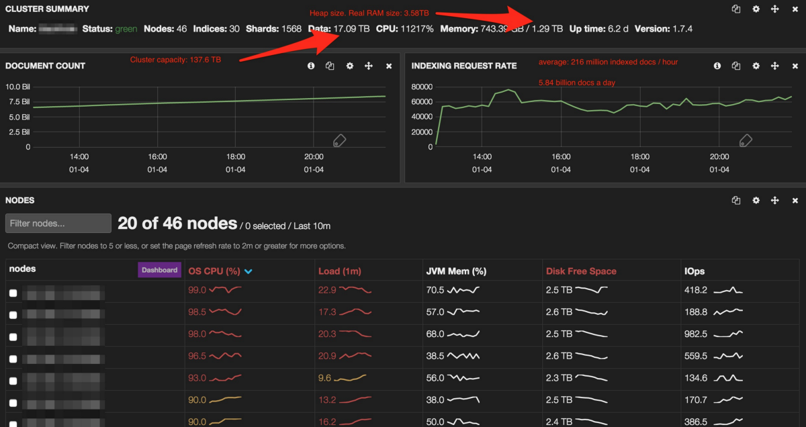

This time, we won't reindex Blackhole but Blink. Blink stores the data we display in our clients dashboards. We need to reindex them every time we change the mapping to enrich that data and add new feature our clients and colleagues love.

### A glimpse at our infrastructure

Blink is a group of 3 clusters built around 27 physical hosts each, having 64GB RAM and 4 core / 8 threads Xeon D-1520. They are small, affordable and disposable hosts. The topology is the same for each cluster:

* 3 master nodes (2 in our main data center and 1 in our backup data center plus a virtual machine ready to launch in case of major outage)
* 4 http query nodes (2 in each data center)
* 20 data nodes (10 in each data center)

The data nodes have 4*800GB SSD drives in RAID0, about 58TB per cluster. The data and nodes are configured with Elasticsearch zones awareness. With 1 replica for each index, that makes sure we have 100% of the data in each data center so we're crash proof.

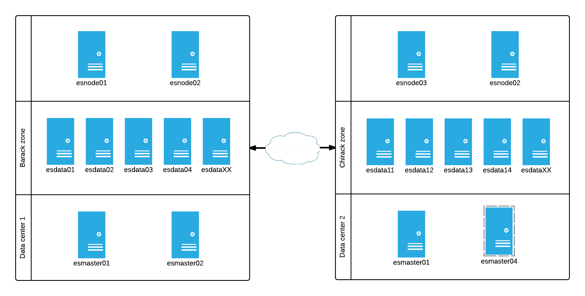

We didn't allocate the http query nodes to a specific zone for a reason: we want to use the whole cluster when possible, at the cost of 1.2ms of network latency. From [Elasticsearch documentation](https://www.elastic.co/guide/en/elasticsearch/reference/current/allocation-awareness.html):

When executing search or GET requests, with shard awareness enabled, Elasticsearch will prefer using local shards --- shards in the same awareness group --- to execute the request. This is usually faster than crossing racks or awareness zones.

In front of the clusters, we have a layer 7 load balancer made of 2 servers each running Haproxy and holding various virtual IP addresses (VIP). A keepalived ensures the active load balancer holdes the VIP. Each load balancer runs in a different data center for fault tolerance. Haproxy uses the allbackups configuration directive so we access the query nodes in the second data center only when the two first ones are down.

```
frontend blink_01
	bind 10.10.10.1:9200
	default_backend be_blink01

backend be_blink01
	balance leastconn
	option allbackups
	option httpchk GET /_cluster/health
	server esnode01 10.10.10.2:9200 check port 9200 inter 3s fall 3
	server esnode02 10.10.10.3:9200 check port 9200 inter 3s fall 3
	server esnode03 10.10.10.4:9200 check port 9200 inter 3s fall 3 backup
	server esnode04 10.10.10.5:9200 check port 9200 inter 3s fall 3 backup
```

So our infrastructure diagram becomes:

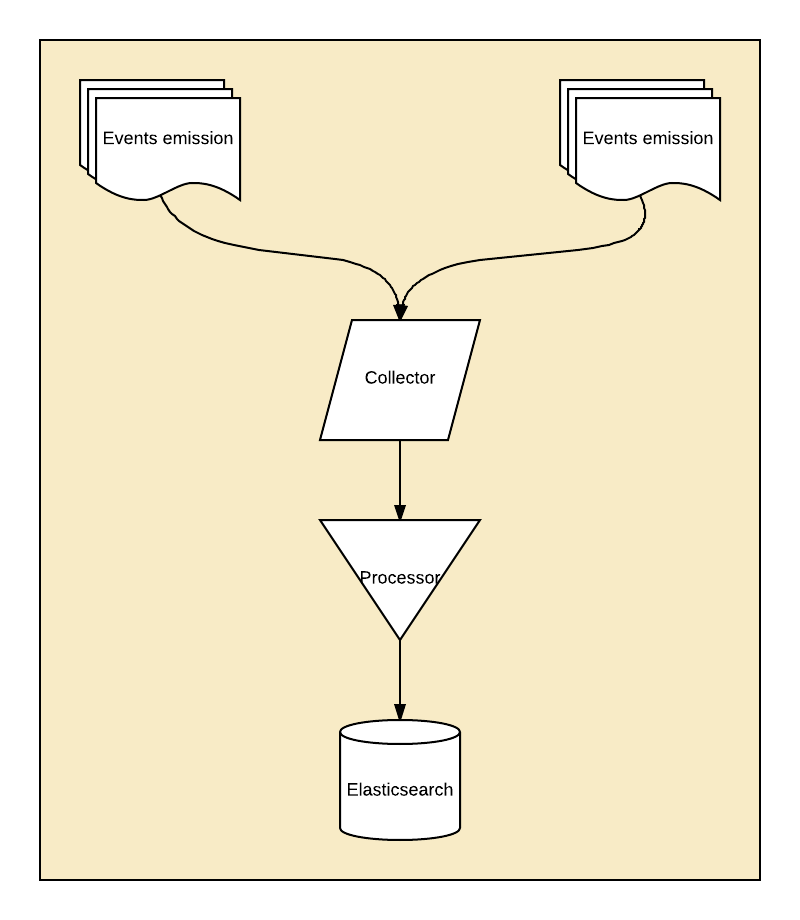

In front of the Haproxy, we have an applicative layer called Baldur. Baldur was developed by my colleague [Nicolas Bazire](https://github.com/nicbaz) to handle multiple versions of a same Elasticsearch index and route queries amongst multiple clusters.

There's a reason why we had to split the infrastructure in multiple clusters even though they all run the same version of Elasticsearch, the same plugins, and they do exactly the same things. Each cluster supports about 10,000 indices, and 30,000 shards. That's a lot, and Elasticsearch master nodes have a hard time dealing with so much indexes and shards.

Baldur is both an API and an applicative load balancer built on Nginx with the LUA plugin. It connects to a MySQL database and has a local memcache based cache. Baldur was built for 2 reasons:

to tell our API the active index for a dashboard

to tell our indexers which indexes they should write in, since we manage multiple versions of the same index.

In elasticsearch, each index has a defined naming: `<mapping version>_<dashboard id>`

In baldur, we use have 2 tables:

The first one is the indexes table with the triplet

```
id / cluster id / mapping id
```

That's how we manage to index into multiple versions of a same index with the ongoing data during the migration process from one mapping to another.

The second table is the reports table with the triplet

```
client id / report id / active index id
```

So the API knows which index it should use as active.

Just like the load balancers, Baldur holds a VIP managed by another Keepalived, for fail over.


### Using Elasticsearch for fun and profit

Since you know everything you need about our infrastructure, let's talk about playing with our Elasticsearch cluster the smart way for fun and, indeed, profit.

Elasticseach and our indexes naming allows us to be lazy so we can watch more cute kitten videos on Youtube. To create an index with the right mapping and settings, we use Elasticsearch templates and auto create index patterns.

Every node in the cluster has the following configuration:

```
action.auto_create_index: +<mapping id 1>_*,+<mapping id 2>_*,-*
```

And we create a template in Elasticsearch for every mapping we need.

```
PUT /_template/template_<mapping id> {
	"template": "<mapping id>_*",
	"settings": {
		"number_of_shards": 1
	},
	"mappings": {
		"add some json": "here"
	},
	"mappings": {
		"add some json": "here"
	}
}
```

Every time the indexer tries to write into a not yet existing index, Elasticsearch creates it with the right mapping. That's the magic.

Except this time, we don't want to create empty indexes with a single shard as we're going to copy existing data.

After playing with Elasticsearch for years, we've noticed that the best size / shard was about 10GB. This allows faster reallocation and recovery at a cost of more Lucene segments during heavy writing and more frequent optimization.

On Blink, 1,000,000 documents weight about 2GB so we're creating indexes with 1 shard for each 5 million documents + 1 when the dashboard already has more than 5 million documents.

Before reindexing a client, we run a small script to create the new indexes with the right amount of shards. Here's a simplified version without error management for your eyes only.

```
curl -XPUT http://esnode01:9200/<new mapping id>_<dashboard id> -d '{ "settings.index.number_of_shards" : '$(( $(curl -XGET http://esnode01:9200/<old mapping id>_<dashboard_id>/_count | cut -f 2 -d : | cut -f 1 -d ",") / 5000000 + 1))'}'
```

Now we're able to reindex, except we didn't solve the CPU issue. That's where fun things start.

What we're going to do is to leverage Elasticsearch zone awareness to dedicate a few data nodes to the writing process. You can also add some new nodes if you can't afford removing a few from your existing cluster, it works exactly the same way.

First, let's kick out all the indexes from those nodes.

```
PUT /_cluster/settings {
	"transient" : {
		"cluster.routing.allocation.exclude._ip" : "<data node 1>,<data node 2>,<data node x>"
	}
}
```

Elasticsearch then moves all the data from these nodes to the remaining ones. You can also shutdown those nodes and wait for the indexes to recover but you might lose data.

Then, for each node, we edit Elasticsearch configuration to assign these nodes to a new zone called *envrack* (fucked up in French). We put all these machines in the secondary data center to use the spare http query nodes for the indexing process.

```
node.zone: 'envrack'
```

Then restart Elasticsearch so it runs with the new configuration.

We don't want Elasticsearch to allocate the existing indexes to the new zone when we bring back these nodes online, so we update these index settings accordingly.

```
curl -XPUT http://esmaster01:9200/<old mapping id>_*/_settings -d '{

"routing.allocation.exclude.zone" : "envrack"

}';
```

The same way, we don't want the new indexes to be allocated to the production zones, so we update the creation script.

```
#!/bin/bash

shards=1

counter=$(curl -XGET [[http://esnode01:9200/]{.underline}](http://esnode01:9200/)<old mapping id>_<dashboard_id>/_count | cut -f 2 -d : | cut -f 1 -d ",")

if [ $counter -gt 5000000 ]; then

shards=$(( $counter / 5000000 + 1 ))

fi

curl -XPUT [[http://esnode01:9200/]{.underline}](http://esnode01:9200/)<new mapping id>_<dashboard id> -d '{

"settings" : {

"index.number_of_shards" : '$counter',

"index.numer_of_replicas" : 0,

"routing.allocation.exclude.zone" : "barack,chirack"

}

}
```

More readable than a oneliner isn't it?

We don't add a replica for 2 reasons:

The cluster is zone aware and we only have one zone for the reindexing

Indexing with a replica means indexing twice, so using twice as much CPU. Adding a replica after indexing is just transferring the data from one host to another.

Indeed, losing a data node means losing data. If you can't afford reindexing an index multiple times in case of crash, don't do this and add another zone or allow your new indexes to use the data from the existing zone in the backup data center.

There's one more thing we want to do before we start indexing.

Since we've set the new zone in the secondary data center, we update the http query nodes configuration to make them zone aware so they read the local shards in priority. We do the same with the active nodes so they read their zone first. That way, we can query the passive http query nodes when reading during the reindexing process with little hassle on what the clients access.

In the main data center:

```
node:

zone: 'barack'
```

And in the secondary:

```
node:

zone: 'chirack'
```

Here's what our infrastructure looks like now.


It's now time to reindex.

We first tried to reindex taking the data from our database clusters, but it put them on their knees. We have large databases and our dashboard are made of documents crawled over time, which means large queries on a huge dataset, with random accesses only. In one word: sluggish.

What we're doing then is copy the existing data, from the old indexes to the new ones, then add the stuff that makes our data richer.

To copy the content of an existing index into a new one, [[Logstash]{.underline}](https://www.elastic.co/products/logstash) from Elastic is a convenient tool. It takes the data from a source, transforms it if needed and pushes it into a destination.

Our Logstash configuration are pretty straightforward:

```
input {

elasticsearch {

hosts => [ "esnode0{3,4}" ]

index => "<old mapping id>_INDEX_ID"

size => 1000

scroll => "5m"

docinfo => true

}

}

output {

elasticsearch {

host => "esdataXX"

index => "<new mapping id>_INDEX_ID"

protocol => "http"

index_type => "%{[[[@metadata]{.underline}](http://twitter.com/metadata)][_type]}"

document_id => "%{[[[@metadata]{.underline}](http://twitter.com/metadata)][_id]}"

workers => 10

}

stdout {

codec => dots

}

}
```

We can now run Logstash from a host inside the secondary data center.

Here, we:

* read from the passive http query nodes. Since they're zone aware, they query the data in the same zone in priority
* write on the data nodes inside the indexing zone so we won't load the nodes accessed by our clients


Once we've done with reindexing a client, we update Baldur to change the active indexes for that client. Then, we add a replica and move the freshly baked indexes inside the production zones.

```
curl -XPUT [[http://esnode01:9200/]{.underline}](http://esnode01:9200/)<new mapping id>_<dashboard id> -d '{

"settings" : {

"index.numer_of_replicas" : 1,

"routing.allocation.exclude.zone" : "envrack",

"routing.allocation.include.zone" : "barack,chirack"

}

}
```

Now, we're ready to delete the old indexes for that client.

```
curl -XDELETE http://esnode01:9200/<old mapping_id>_<dashboard id>
```

### Conclusion

This post doesn't deal with cluster optimization for massive indexing on purpose. The Web is full of articles on that topic so I decided it didn't need another one.

What I wanted to show is how we managed to isolate the data within the same cluster so we didn't disturb our clients. Considering our current infrastructure, building 3 more clusters might have been easier, but it has a double cost we didn't want to afford.

First, it means doubling the infrastructure, so buying even more servers you won't use anymore after the reindexing process. And it means buying these servers 1 or 2 months upfront to make sure they're delivered in time.

I hope you enjoyed reading that post as much as I enjoyed sharing my experience on the topic. If you did, please share it around you, it might be helpful to someone!

## How we reindexed 36 billion documents in 5 days within the same Elasticsearch cluster

At [[Synthesio]{.underline}](http://www.synthesio.com/), we use [[ElasticSearch]{.underline}](http://elastic.co/) at various places to run complex queries that fetch up to 50 million rich documents out of tens of billion in the blink of an eye. Elasticsearch makes it fast and easily scalable where running the same queries over multiple MySQL clusters would take minutes and crash a few servers on the way. Every day, we push Elasticsearch boundaries further, and going deeper and deeper in its internals leads to even more love.

Last week, we decided to reindex a 136TB dataset with a brand new mapping. Updating an Elasticsearch mapping on a large index is easy until you need to change an existing field type or delete one. Such updates require a complete reindexing in a separate index created with the right mapping so there was no easy way out for us.

### The "Blackhole" cluster

We've called our biggest Elasticsearch cluster "Blackhole", because that's exactly what it is: a hot, ready to use datastore being able to contain virtually any amount of data. The only difference with a real blackhole is that we can get our data back at the speed of light.

When we designed blackhole, we had to chose between 2 different models.

A few huge machines with 4 * 12 core CPU, 512GB of memory and 36 800GB SSD drives, each of them running multiple instances of Elasticsearch.

A lot of smaller machines we could scale horizontally as the cluster grows.

We opted for the latter since it would make scaling much easier and didn't require spending too much money upfront.

Blackhole runs on 75 physical machines:

* 2 http nodes, one in each data center behind a [[HAProxy]{.underline}](http://www.haproxy.org/) to load balance the queries.
* 3 master nodes located in 3 different data center.
* 70 data nodes into 2 different data center.

Each node has quad core Xeon D-1521 CPU running at 2.40GHz and 64GB of memory. The data nodes have a RAID0 over 4*800GB SSD drives with XFS. The whole cluster runs a Systemd less Debian Jessie with a 3.14.32 vanilla kernel. The current version of the cluster has 218,75TB of storage and 4,68TB of memory with 2.39TB being allocated to Elasticsearch heap. That's all for the numbers.

### Elasticsearch configuration

Blackhole runs ElasticSearch 1.7.5 on Java 1.8. Indexes have 12 shards and 1 replica. We ensure each data center hosts 100% of our data using Elasticsearch [[rack awareness]{.underline}](https://www.elastic.co/guide/en/elasticsearch/reference/current/allocation-awareness.html) feature. This setup allows to crash a whole data center without neither data loss nor downtime, which we test every month.

All the filtered queries are ran with *_cache=false.* ElasticSearch caches the filtered queries result in memory, making the whole cluster explode at the first search. Running queries on 100GB shards, this is not something you want to see.

When running in production, our configuration is:

```
routing:

allocation:

node_initial_primaries_recoveries: 20

node_concurrent_recoveries: 20

cluster_concurrent_rebalance: 20

disk:

threshold_enabled: true

watermark:

low: 60%

high: 78%

index:

number_of_shards: 12

number_of_replicas: 1

merge:

scheduler:

max_thread_count: 8

type: 'concurrent'

policy:

type: 'tiered'

max_merged_segment: 100gb

segments_per_tier: 4

max_merge_at_once: 4

max_merge_at_once_explicit: 4

store:

type: niofs

query:

bool:

max_clause_count: 10000

action:

auto_create_index: false

indices:

recovery:

max_bytes_per_sec: 2048mb

fielddata:

breaker:

limit: 80%

cache:

size: 25%

expire: 1m

store:

throttle:

type: 'none'

discovery:

zen:

minimum_master_nodes: 2

ping:

multicast:

enabled: false

unicast:

hosts: ["master01","master02","master03"]

threadpool:

bulk:

queue_size: 3000

type: cached

index:

queue_size: 3000

type: cached

bootstrap:

mlockall: true

memory:

index_buffer_size: 10%

http:

max_content_length: 1024mb
```

After trying both ElasticSearch default_fs and mmapfs, we've picked up [[niofs]{.underline}](https://www.elastic.co/guide/en/elasticsearch/reference/current/index-modules-store.html)for file system storage.

> The NIO FS type stores the shard index on the file system (maps to Lucene [[NIOFSDirectory]{.underline}](https://lucene.apache.org/core/5_2_0/core/org/apache/lucene/store/NIOFSDirectory.html)) using NIO. It allows multiple threads to read from the same file concurrently.

The reason why we decided to go with niofs is to let the kernel manage the file system cache instead of relying on the broken, out of memory error generator mmapfs.

### Tuning the Java virtual machine

We launch the java virtual machine with *-Xms31g -Xmx31g*. Combined with ElasticSearch *mlockall=true*, it ensures ElasticSearch gets enough memory to run and never swaps. The remaining 33GB are used for ElasticSearch threads and file system cache.

Despite ElasticSearch recommendations we have replaced the [[Concurrent Mark Sweep]{.underline}](https://docs.oracle.com/javase/8/docs/technotes/guides/vm/gctuning/cms.html) (CMS) garbage collector with the [[Garbage First Garbage Collector]{.underline}](http://www.oracle.com/technetwork/tutorials/tutorials-1876574.html) (G1GC). With CMS, we would run into a stop the world garbage collection for every single query on more than 1 month of data.

Our configuration of G1GC is relatively simple but does the job under pressure:

```
JAVA_OPTS="$JAVA_OPTS -XX:-UseParNewGC"
JAVA_OPTS="$JAVA_OPTS -XX:-UseConcMarkSweepGC"
JAVA_OPTS="$JAVA_OPTS -XX:+UseCondCardMark"

JAVA_OPTS="$JAVA_OPTS -XX:MaxGCPauseMillis=200"

JAVA_OPTS="$JAVA_OPTS -XX:+UseG1GC "

JAVA_OPTS="$JAVA_OPTS -XX:GCPauseIntervalMillis=1000"

JAVA_OPTS="$JAVA_OPTS -XX:InitiatingHeapOccupancyPercent=35"
```

### Blackhole Initial indexing

We started the initial indexing mid December 2015. It took 19 days from fetching the raw data to pushing it into ElasticSearch.

Back then, Blackhole only had 46 nodes:

* 3 master nodes
* 1 query node
* 42 data nodes

This led to a cluster sized for 30 months of data with 1.29TB of memory and 134TB of storage, all SSD.

For this initial indexing, we decided to go with 1 index per month and 30 shards per index. This didn't work as expected as each query on a month would request data from 3TB and 1.2 billion documents. As most queries went on 3 to 12 months, this made the cluster impossible to scale properly.

The first part of the process took 10 days. We had to fetch 30 billion documents from our main [[Galera]{.underline}](http://galeracluster.com/products/) datastore, turn it into JSON and push it into a [[Kafka]{.underline}](https://kafka.apache.org/) queue, each month of data being pushed into a different Kafka partition. Since we were scanning the database incrementally, the process went pretty fast considering the amount of data we were processing.

The migration processes were running on 8 virtual machines with 4 core and 8GB RAM. Each machine was running a 8 processes of a [[Scala]{.underline}](http://www.scala-lang.org/) homemade program.

During the second part, we merged the data from the Kafka with data from 2 other Galera clusters and an Elasticsearch cluster before pushing them into Blackhole.


### Blackhole initial migration

The merge and indexing parts took place on 8 virtual machines, each having 4 core and 8GB RAM. Each machine was running 8 indexing processes reading an offset of a Kafka partition.

The indexer was shard aware. It had a mapping between the index it was writing on, its shards and the data node they were hosted on. This allowed to index directly on the right data nodes with the lowest possible network latency.

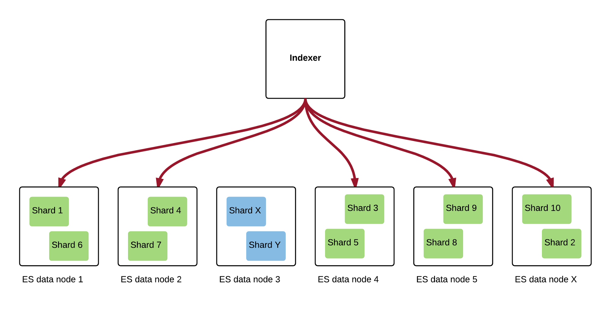

This part was not as smooth as we expected.

The first version of the indexer was developed in Scala, but for some reasons was slow as hell, not being able to index more than 30,000 documents per second. We rewrote it in Go in 2 days, and it was much better, with an average of 60,000 indexed documents per second, with peaks at 120,000 documents per second.

Surprisingly, the main bottleneck was neither one of the Galera clusters nor the Elasticsearch metadata cluster, but the Kafka queues. For some reasons, we could not read more than 10,000 documents per second per Kafka partition.

The other unexpected bottleneck was the CPU. Surprisingly, we were CPU bound but the disks were not a problem (which is normal since we're using SSDs).


After 9 days, the data was fully indexed and we could start playing with the data.

### Blackhole reindexing

When we decided to change Blackhole mapping, we had enough experience with the cluster and its content to avoid previous mistakes and go much faster.

Instead of monthly indexes, we decided to split the cluster into daily indexes. A few tests on a migrating index showed it was the way to go.

With the new mapping dropping a bunch of data, we moved from 3GB for 1 million documents (with a replica) to 2GB for 1 million documents. Going daily reduced the average index from 3TB to 120GB, and a single shard from 100GB to 10GB. Having a large number of machines, this allowed to better use the ressources, starting with the JVM heap, running parallel queries.

### The reindexing process

Instead of polling the data from our database clusters, we decided to reuse the data from Blackhole itself. This meant reading and writing on the same cluster simultaneously, adding some fun in the operation.

This time, we did not use separate virtual machines to host the indexing processes. Instead, we decided to run the indexers on the data nodes, read locally and write on their counterpart in the secondary data center. Considering a 10Gb link and a 46ms network latency, that solution was acceptable. It meant we had 70 machines to both read and write to, allowing maximum parallelism.

There are many solutions to copy an Elasticsearch index to another, but most of them neither allow splitting one to many or change the data model. Unfortunately, the new mapping involved deleting some fields and moving other fields somewhere else. Since we did not have the time to build a homemade solution, we decided to go with [[Logstash]{.underline}](https://www.elastic.co/products/logstash).

Logstash has both an Elasticsearch input, for reading, an Elasticsearch output, for writing, and a *transform* filter to change the data model. The *input* module accepts a classic Elasticsearch query and the *output* module can be parallelized.

We ran a few tests on Blackhole to determine which configuration was the best, and ended with 5000 documents scrolls and 10 indexing workers.

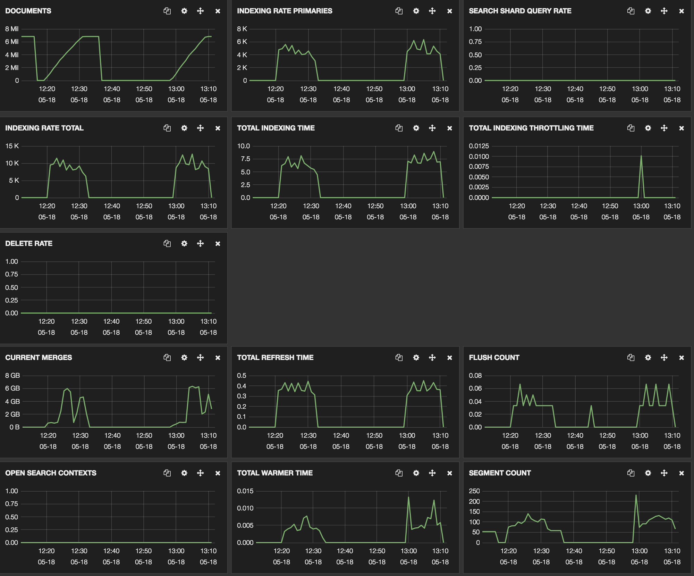

Testing with 5000 documents scroll and 10 workers

For these tests, we were running with a production configuration, which explains the refreshes and segment count madness. Indeed, running with 0 replica was faster, but since we're using RAID0, this configuration was a no go.

During the operation, both source and target nodes behaved without problems, specifically on the memory level.


Source node for reindexing


Target node behavior

For the first tests, we ran logstash against a full day of reindexation, using a simple Elasticsearch query:

```
query => '{ "query": { "range": { "date": { "gte": "yyyy-mm-ddT00:00.000", "lte": "yyyy-mm-dd+1T00:00.000+01:00" } } } }
```

Unfortunately, for some reasons, we had missing documents because our scroll keepalive of 5 minutes was too short. This made catching up with the data too long as we had to replay the whole day, so we decided to run hourly queries.

### Logstash configuration

```
input {

elasticsearch {

hosts => [ "local elasticsearch node" ]

index => "index to read from"

size => 5000

scroll => "20m" # 5 minutes initial

docinfo => true

query => '{ "query": { "range": { "date": { "gte": "2015-07-23T10:00.000+01:00", "lte": "2015-07-23T11:00.000+01:00" } } } }'

}

}

output {

elasticsearch {

host => "remote elasticsearch node"

index => "index to write to"

protocol => "http"

index_type => "%{[[[@metadata]{.underline}](http://twitter.com/metadata)][_type]}"

document_id => "%{[[[@metadata]{.underline}](http://twitter.com/metadata)][_id]}"

workers => 10

}

stdout {

codec => rubydebug # because removing the timestamp field makes logstash crash

}

}

filter {

mutate {

rename => { "some field" => "some other field" }

rename => { "another field" => "somewhere else" }

remove_field => [ "something", "something else", "another field", "some field", "[[@timestamp]{.underline}](http://twitter.com/timestamp)", "[[@version]{.underline}](http://twitter.com/version)" ]

}

}
```

### Reindexing Elasticsearch configuration

We changed only a few settings for that reindexing.

```
memory:

index_buffer_size: 50% (instead of 10%)

index:

store:

throttle:

type : "none" (as fast as your SSD can go)

translog:

disable_flush: true

refresh_interval: -1 (instead of 1s)

indices:

store:

throttle:

max_bytes_per_sec: "2gb"
```

We wanted to limit the Lucene refreshes as much as we could, preferring to manage hundreds of thousand segments instead of limiting our throughput for CPU overhead.

### Introducing Yoko and Moulinette

To manage the indexing process, we have created 2 simple tools: Yoko and Moulinette.

Yoko and Moulinette use a simple MySQL database with every index to process, query to run and status. The data model is pretty self explanatory:

```
CREATE TABLE `yoko` (

`index_from` varchar(16) NOT NULL,

`index_to` varchar(16) NOT NULL,

`logstash_query` text NOT NULL,

`status` enum("todo", "processing", "done", "complete", "failed") DEFAULT "todo"

);
```

Before indexing, we fill in the Yoko database with every index we want to migrate along with all the logstash queries we need to run. One line contains the source index, destination index and the query to reindex 1 hour of data.

Yoko is a simple Python daemon that manages the global indexing processes. It:

Creates the daily indexes when they don't exist yet with the right mapping.

Checks for every "done" daily index and compares the number of documents from the initial index running the logstash query.

Moves each successful "done" line to "complete" if the count matches or "failed".

Delete each monthly index when every day of a month is "complete".

Changes the refresh values when a daily index is "complete".

```
PUT /index/_settings?master_timeout=120s

{

"translog.disable_flush" : "false",

"index" : {

"refresh_interval" : "1s"

}

}
```

Moulinette is the processing script. It's a small daemon written in Bash (with some ugly bashisms) that runs on every indexing node. It fetches lines in "todo" from the *yoko* table, generates the logstash.conf with the source and destination index, and source and destination node and Logstash query. Then it runs Logstash, and once Logstash exits, switches the line to "done" if Logstash exit code is 0, or "failed" otherwise.

### Reindexing in 5 days

Once again, the main problem was being CPU bound. As you can see on that Marvel screenshot, the cluster was put under heavy load during the whole indexing process. Considering that we were both reading and writing on the same cluster, **with an indexing rate over 90,000 documents per second with 140,000 documents per second peaks**, this is not surprising at all.

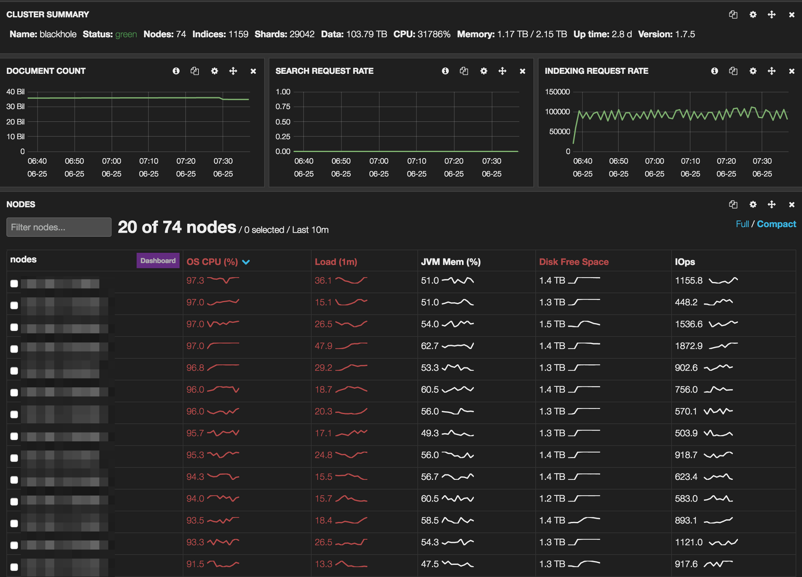

Reindexing blackhole, 2 days after

Having a look at the CPU graphs, there was little we could to to improve the throughput without dropping Logstash and relying on a faster solution running on less nodes.

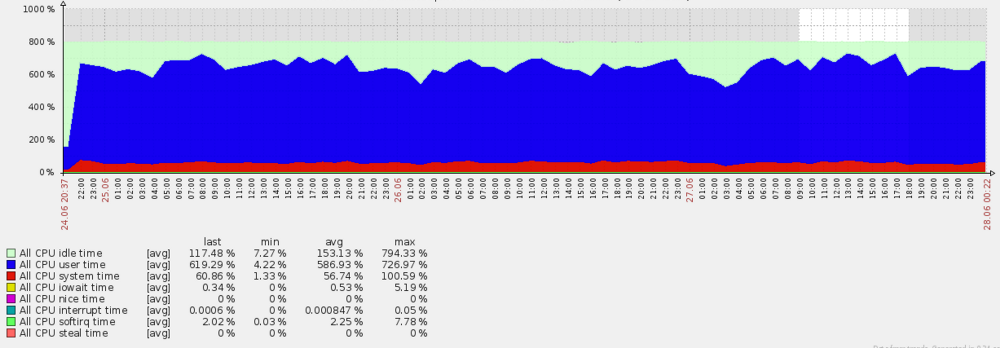

CPU usage

The disks operations show well the scroll / index processing. There was certainly some latency inside Logstash for the transform process, but we didn't track it.


Disks operations

The other problem was losing nodes. We had some hardware issues and lost some nodes here and there. This caused indexing from that node to crash and indexing to that node to stale since Logstash does not exit when the output endpoint crashes.

This caused many lost time checking (almost) manually logs on every node once or twice a day. If an hourly index took more than 3 hours to process, we would consider it lost and restart Moulinette and move the hourly index to "todo".

Lesson learned, Yoko and Moulinette V2 will have a better silent error handling. When an index is blocked for more than 3 hours, Yoko will raise an alert and move the index to "todo". The alert will allow to kill the locked Logstash process and restart Moulinette as soon as there's a problem.

The next step is optimizing the indexes, moving from an average of 1500 Lucene segments post indexing to 24 (1 segment per replica). This aims both at improving the performances and removing completely the deleted documents we had after restarting the indexing post crash. When overwriting or deleting a document, Lucene does not actually delete it but flags it at "deleted" until an optimize is performed.

Our optimize script is extremely simple, starting with the indexes that have the most important number of deleted documents to save space.

```
#!/bin/sh

HOST=$1

CURL_BIN=$(which curl)

if [ -z "$HOST" ]; then

echo "Host is missing"

exit 1

fi

if [ -z "$CURL_BIN" ]; then

echo "Curl binary is missing"

exit 1

fi

for indice in $(${CURL_BIN} -XGET [[http://$]{.underline}](http://$/){HOST}:9200/_cat/indices | sort -rk 7 | awk '{print $3}'); do

if [ ! -z "$indice" ]; then

echo $(date +"%Y%m%d %H:%M") Processing indice ${indice}

${CURL_BIN} -XPOST [[http://$]{.underline}](http://$/){HOST}:9200/${indice}/_optimize?max_num_segments=1

echo

fi

done

exit 0
```

### Conclusion

Reindexing a large Elasticsearch cluster with major data mode changes was quite interesting. It allowed us to push Elasticsearch and our hardware boundaries to reach a correct throughput. Yoko and Moulinette are now reusable for every Elasticsearch cluster we run at Synthesio, allowing reindexing within a same cluster or cross clusters.

## Migrating a 130TB Cluster from Elasticsearch 2 to 5 in 20 Hours with 0 Downtime and a Rollback Strategy

Do you remember [[Blackhole, the 36 billion documents Elasticsearch cluster]{.underline}](https://thoughts.t37.net/how-we-reindexed-36-billions-documents-in-5-days-within-the-same-elasticsearch-cluster-cd9c054d1db8)we had to reindex a while ago? Blackhole is now a 130TB grownup with 100 billion documents, and my last task before I left Synthesio was migrating the little boy to Elasticsearch 5.1. This post is a more detailed version of the talk I gave November the 23rd at the ElasticFR meetup in Paris.

There were many reasons for upgrading Blackhole: feature, performances, better monitoring data exposed. But for me, the main reason to do it before I leave was **for the lulz**. I love running large clusters, whatever the software, I love [[performing huge migrations]{.underline}](https://thoughts.t37.net/how-we-upgraded-a-22tb-mysql-cluster-from-5-6-to-5-7-in-9-months-cc41b391895d), and the bigger, the better.

### Elasticsearch @Synthesio, November 2017

At [[Synthesio]{.underline}](https://www.synthesio.com/), we're using Elasticsearch pretty much everywhere as soon as we need hot storage. Cold storage is provided by MySQL and queuing by a bit more than 100TB of Apache Kafka.

There are 8 clusters running in production, with a bit more than 600 bare metal servers, with 1.7PB storage and 37.5TB RAM. Clusters are hosted in 3 data centers. One of them is dedicated to running each cluster third master host to avoid split brains when we lose a whole data center, which happens from time to time.

The servers are mostly 6 core, 12 threads Xeon E5--1650v3 with 64GB RAM and 4*800GB SSD or 2*1.2TB NVME, in RAID0. Some clusters have 12 core bi Xeon E5--2687Wv4 with 256GB RAM.

The average cluster stats are 85k writes / second, with 1.5M in peak, and 800 reads / second, some clusters having a continuous 25k search / second. Doc size varies from 150kB to 200MB.

### The Blackhole Cluster

Blackhole is a 77 nodes cluster, with 200TB storage, 4.8TB RAM, 2.4TB being allocated to Java, and 924 CPU core. It is made of 3 master nodes, 6 ingest nodes, and 68 data nodes. The cluster holds 1137 indices, with 13613 primary shards, and 1 replica, for 201 billion documents. It gets about 7000 new documents / second, with an average of 800 searches / second on the whole dataset.

Blackhole data nodes are spread between 2 data center. By using rack awareness, we make sure that each data center holds 100% of the data, for high availability. Ingest nodes are rack aware as well, to leverage Elasticsearch prioritising nodes within the same rack when running a query. This allows us to minimise the latency when running a query. A Haproxy controls both the ingest nodes health and proper load balancing amongst all of them.

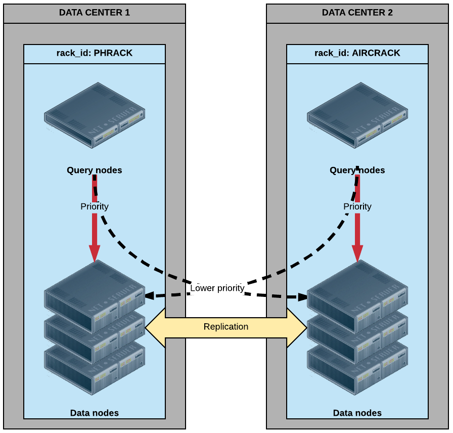

Blackhole rack awareness design

Blackhole is feeding is a small part of a larger processing chain. After multiple enrichment and transformation, the data is pushed into a large Kafka queue. A working unit reads the Kafka queue and pushes the data into Blackhole.

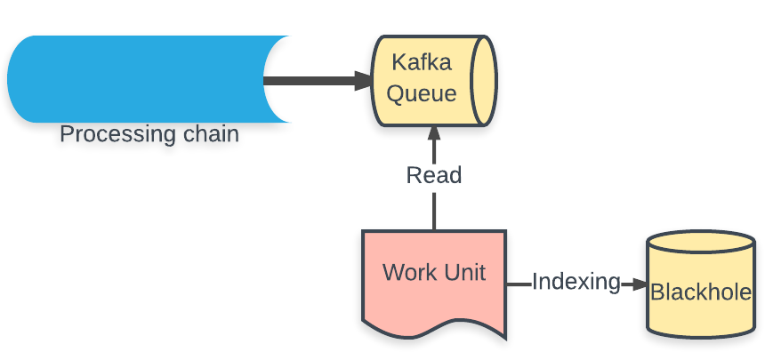

This has many pros, the first one being to be able to replay a whole part of the process in case of error. The only con here is having enough disk space for the data retention, but in 2017 disk space is not a problem anymore, even on a 10s of TB scale.

### Migration Strategies: Cluster restart VS Reindex API VS Logstash VS the Fun Way

There are many ways to migrate an Elasticsearch cluster from a major version to another.

#### The Cluster Restart Strategy

Elasticsearch regular upgrade path from 2.x to 5.x requires to close every index using the [*_close* API endpoint](https://www.elastic.co/guide/en/elasticsearch/reference/current/indices-open-close.html), upgrade the software version, start the nodes, then open the indexes again using the *_open* API endpoint.

Relying on the cluster restart strategy means keeping indexes created with Elasticsearch 2. This has no immediate consequence, except being unable to upgrade to Elasticsearch 6 without a full reindex. As this is something we do from time to time anyway, it was not a blocking problem.

On the cons side, the cluster restart strategy requires to shutdown the whole cluster for a while, which was not acceptable.

Someone once said there's a Chinese proverb for everything, and if it doesn't exist yet, you can make it a Chinese proverb anyway.

> When migration requires downtime, throwing more hardware solves all your problems.
> --- Traditional Chinese proverb.

Throwing hardware at our problems meant we could rely on 2 more migration strategies.

#### The Reindex API Strategy

The first one is using [[Elasticsearch reindex API]{.underline}](https://www.elastic.co/guide/en/elasticsearch/reference/6.0/docs-reindex.html). We have already used it to migrate some clusters from Elasticsearch 1.7 to 5.1. It has many cons though, so we decided not to use it this time.

Error handling is suboptimal, and an error on a bulk index means we will lose documents in the process without knowing it.

It is slow. Elasticsearch reindex API relies on scrolling, and [[sliced scrolls]{.underline}](https://www.elastic.co/guide/en/elasticsearch/reference/current/search-request-scroll.html)are not available until version 6.0.

There's also another problem on live indexes. And a huge one: losing data consistency.

To ensure data consistency between the source and destination index, either you never update your data and it's OK, or you decide that all your indexes are write only during the whole reindexing, which implies an application downtime. Otherwise, you have a risk of race condition between your ongoing and the reindex process if the source cluster is updated before the destination cluster just when the data to update needs to be changed. The risk is small but still exists.

#### The Logstash Strategy

We've been using Logstash a lot on Elasticsearch 1.7, as there was no reindex API yet. Logstash is faster than the reindex API, and you can use it inside a script which makes failure management easier.

Logstash has many cons as well, beside the race condition problem. The biggest one is that it is unreliable, and the risk of losing data in the process, without even noticing it, is too high. Logstash console output makes it difficult to troubleshoot errors as it is either too verbose or not enough.

#### The Fun Way

The fun way mixes the Cluster Restart Strategy and throwing hardware at problems, with the con of being able to rollback anytime even after the migration is over. But I don't want to spoil you yet 😈.

### Migrating Blackhole for Real

The Blackhole migration took place on a warm, sunny Saturday. The birds were singing, the sun was shining, and the coffee was flowing in my cup.

Migration Prerequisites

Before starting the migration, we had a few prerequisites to fulfill:

Making sure our mapping template compatibility with Elasticsearch 5.

Using the [[Elasticsearch Migration Helper]{.underline}](https://github.com/elastic/elasticsearch-migration/tree/2.x) plugin on Blackhole, just in case.

Create the next 10 daily indexes, just in case we missed something with the mapping template.

Telling our hosting provider that we would transfer more than 130TB on the network in the coming hours.

#### Expanding Blackhole

The first migration step was throwing more hardware at blackhole.

We added 90 new servers, split in 2 data centers. Each server has a 6 core Xeon E5--1650v3 CPU, 64GB RAM, and 2 * 1.2TB NVME drives, setup as a RAID0. These servers were set up to use a dedicated network range as we planned to use them to replace the old Blackhole cluster and didn't want to mess with the existing IP addresses.

These servers were deployed with a Debian Stretch and Elasticsearch 2.3. We had some issues as Elasticsearch 2 systemd scripts don't work on Stretch, so we had to run the service manually. We configured Elasticsearch to use 2 new racks, Barack and Chirack. Then, we updated the replication factor to 3.

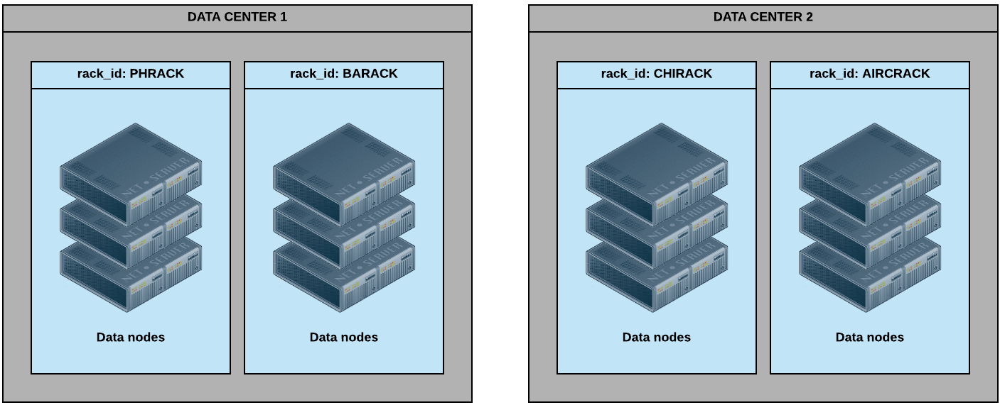

Blackhole, expanded

```
PUT /*/_settings {

"index" : {

"number_of_replicas" : 3

}

}
```

On the vanity metrics level, Blackhole had:

* 167 servers,
* 53626 shards,
* 279TB of data for 391TB of storage,
* 10,84TB RAM, 5.42TB being allocated to Java,
* 2004 core.

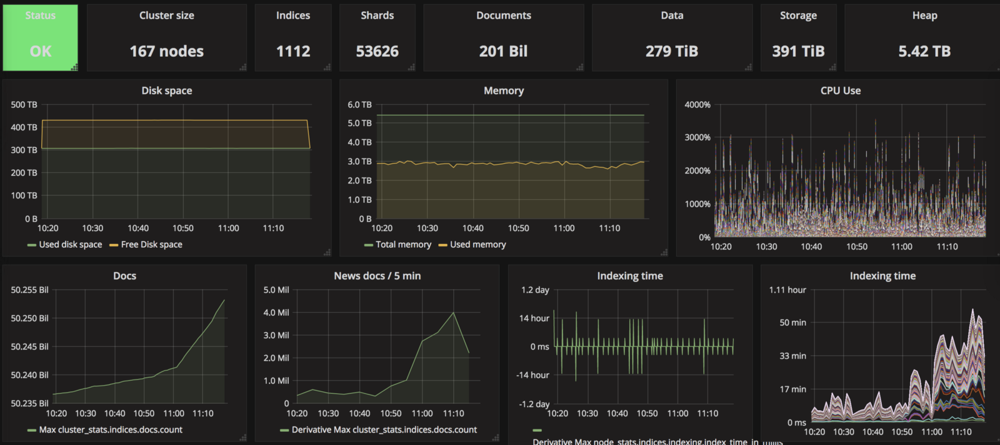

If you're wondering why we didn't decide to save time, only raising the replication factor to 2, then do it, lose a data node, enjoy, and read the basics of distributed systems before you want to run one in production.

Expanding Blackhole, we had to change a few dynamic settings for allocation and recoveries.

Blackhole initial settings were:

```
"cluster.routing.allocation.disk.threshold_enabled" : true "cluster.routing.allocation.disk.watermark.low" : "78%" "cluster.routing.allocation.disk.watermark.high" : "79%"

"cluster.routing.allocation.node_initial_primaries_recoveries": 50 "cluster.routing.allocation.node_concurrent_recoveries": 20

"indices.recovery.max_bytes_per_sec": "2048mb" "indices.recovery.concurrent_streams": "30"

"cluster.routing.rebalance.enable": "all" "cluster.routing.allocation.cluster_concurrent_rebalance": 50 "cluster.routing.allocation.allow_rebalance": "always"
```

We decided to speed up the cluster recovery a bit, and disable the reallocation completely to avoid mixing both of them until the migration was over. To make sure the cluster would use as much disk space as possible without problems, we raised the watermark thresholds to the maximum.

```
"cluster.routing.allocation.disk.watermark.low" : "98%" "cluster.routing.allocation.disk.watermark.high" : "99%"

"indices.recovery.max_bytes_per_sec": "4096mb"

"indices.recovery.concurrent_streams": "50"

"cluster.routing.rebalance.enable": "none"
```

Them Came the Problems

Transferring 130TB of data at up to 4Gb/s puts lots of pressure on the hardware.

The load on most machines was up to 40, with 99% of the CPU in use. Iowait went from 0 to 60% on most of our servers. As a result, Elasticsearch [[bulk thread pool]{.underline}](https://www.elastic.co/guide/en/elasticsearch/reference/current/modules-threadpool.html) queue started to fill dangerously despite being configured to 4000, with a risk of rejected data.

Thankfully, there's a trick for that.

Elasticsearch provides a concept of zone, which can be combined with rack awareness for a better allocation granularity. For example, you can dedicate lot of hardware to the freshest, most frequently accessed content, less hardware to content accessed less frequently and even less hardware to content that is never accessed. Zones are configured on the host level.

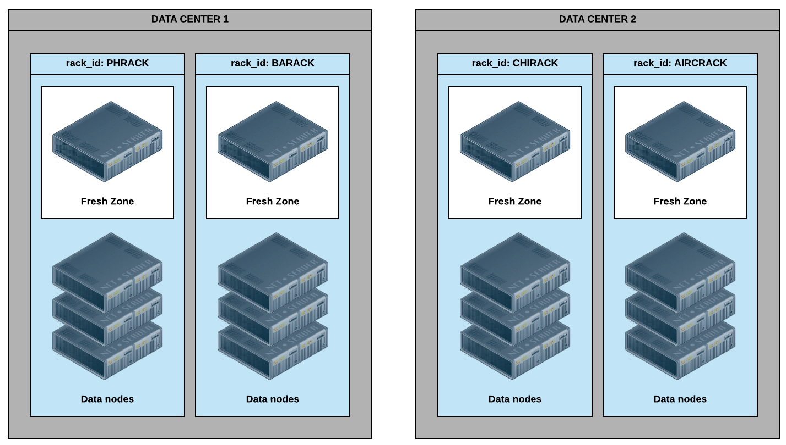

We decided to create a zone that would only hold the data of the day, so the hardware would be less stressed by the migration.

To do it without rollbacking, we decided to disable the recovery, before we forced the indices allocation.

```
PUT /_cluster/settings {

"transient" : {

"cluster.routing.allocation.enable" : "none"

}

}

PUT /*/_settings {

"index.routing.allocation.exclude.zone" : "fresh"

}

PUT /latest/_settings -d {

"index.routing.allocation.exclude.zone" : "",

"index.routing.allocation.include.zone" : "fresh"

}
```

After a few minutes, the cluster was quiet and we were able to resume the migration.

```
PUT /_cluster/settings {

"transient" : {

"cluster.routing.allocation.enable" : "all"

}

}
```

Another way to do it is by playing with the *_ip* exclusion, but when you have more than 150 data nodes, it becomes a bit complicated. Also, you need to know that include and exclude are mutually exclusive, and can lead to some headache the first time you use them.

#### Splitting Blackhole in 2

The next step of the migration was creating a full clone of Blackhole. To clone a cluster, all you need is:

* love
* a bunch of data node with 100% of the data
* a master node from the cluster to clone

Before doing anything, we disabled the shard allocation globally.

```
PUT /_cluster/settings {

"transient" : {

"cluster.routing.allocation.enable" : "none"

}

}
```

Then, we shat down Elasticsearch on Barack, Chirack and one of the cluster master nodes.

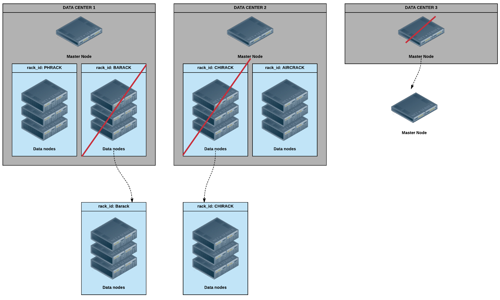

Removing nodes to create a new Blackhole

Then, we reduced the replica number on Blackhole to 1, and enabled allocation.

```
PUT /*/_settings {

"index" : {

"number_of_replicas" : 1

}

}

PUT /_cluster/settings {

"transient" : {

"cluster.routing.allocation.enable" : "all"

}

}
```

**The following step were performed with Elasticsearch being stopped on the removed hosts.**

We changed the excluded master node IP address to move it to a new Blackhole02 cluster network range, as well as the *discovery.zen.ping.unicast.hosts setting* so it was unable to talk to the old cluster anymore. We didn't change the cluster.name since we wanted to reuse all the existing information.

We also reconfigured the nodes within the Barack and Chirack racks to talk to that new master, then added 2 other fresh masters to respect the *discovery.zen.minimum_master_nodes:* 2 settings.

Then, we started Elasticsearch first on the master taken from Blackhole, then on the 2 new master nodes. We had a new cluster without data nodes, but with all the index and shards information. This was done on purpose so we could close all the indexes without losing time with the data nodes being here, trying to reallocate or whatever.

We then closed all the existing indexes:

```
PUT /*/_close
```

It was time to upgrade Elasticsearch on that new Cluster. This was done in a few minutes running our [[Ansible]{.underline}](https://ansible.org/) playbook.

We launched Elasticsearch on the master nodes first, to upgrade the cluster from 2 to 5. It took less than 20 seconds. I was shocked as I expected the process to take a few hours. Did I ever know, I would have asked for a maintenance window, but we would have lost the ability to rollback.

Then, we started the data nodes, enabled allocation again, and 30 minutes later, the cluster was green.

The last thing was to add a work unit to feed that Blackhole02 cluster and catch up with the data. This was made possible by saving the Kafka offset before we shut down the Barack and Chirack data nodes.

### Conclusion

The whole migration took less than 20 hours, including transferring 130TB of data on a dual data center setup.


The most important point here was that we were able to rollback at any time, including after the migration if something was wrong on the application level.

Deciding to double the cluster for a while was mostly a financial debate, but it had lots of pros, starting with the security it brought, as well as changing the whole hardware that had been running for 2 years.
