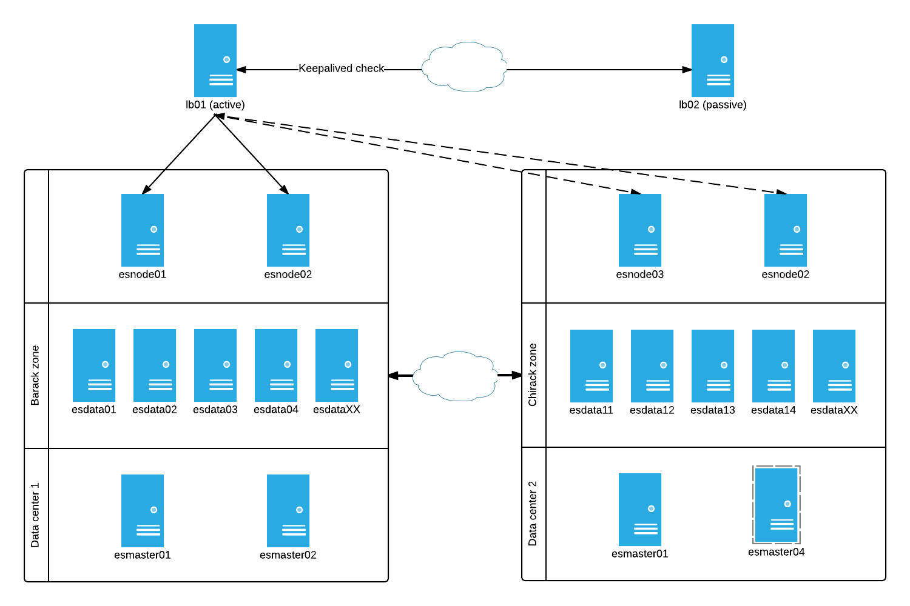
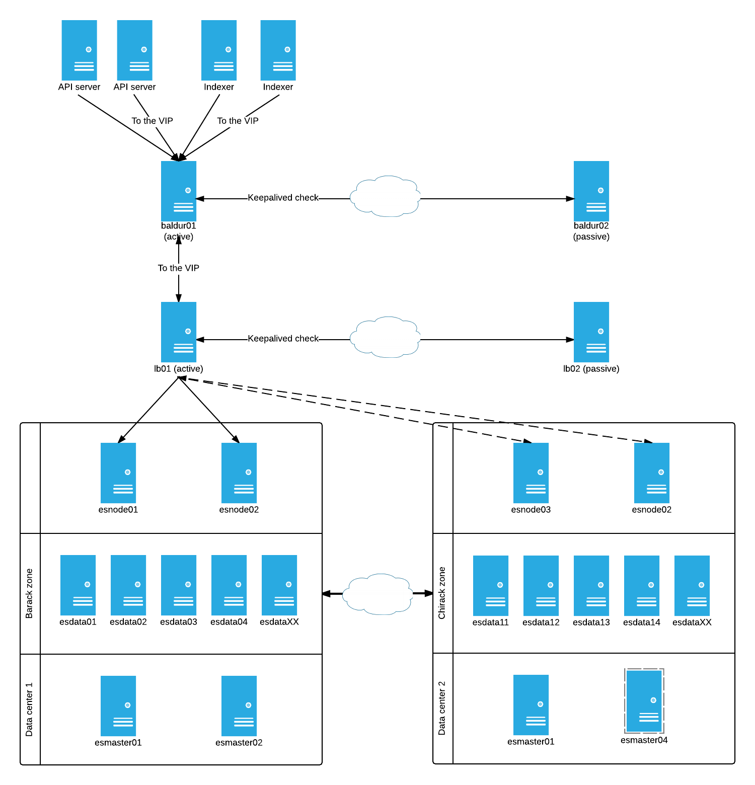
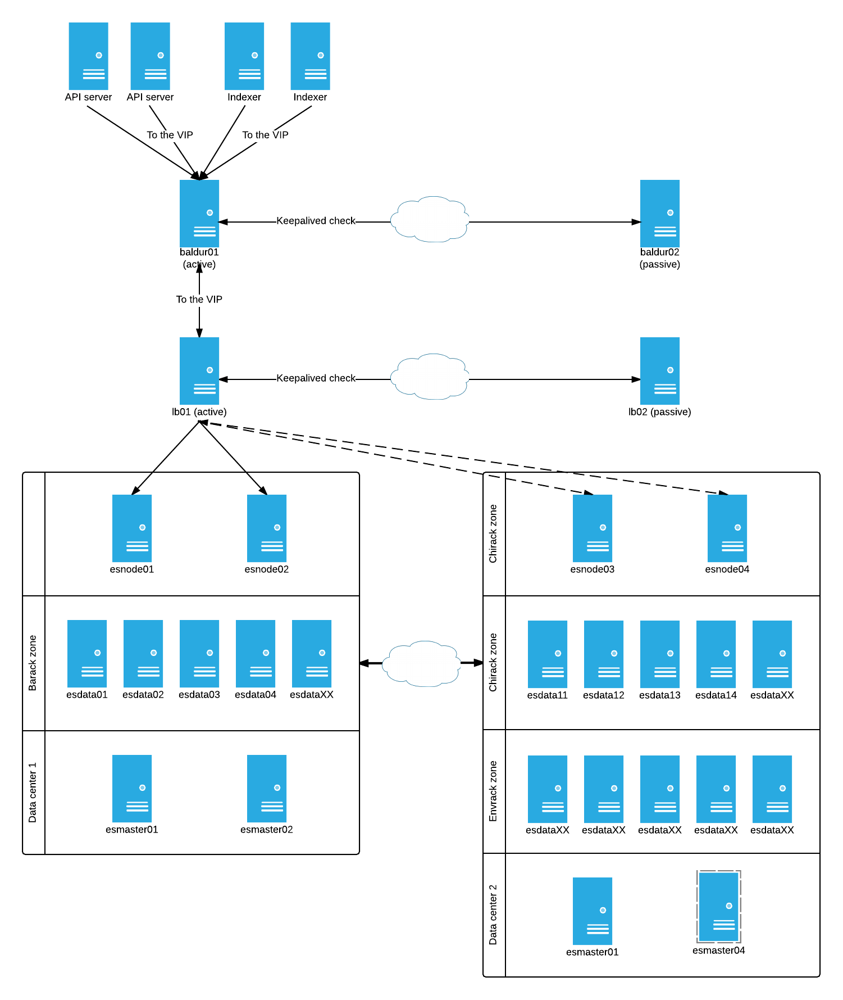

```
WIP, COVERS ELASTICSEARCH 5.5.x
```

# Use Case: An Advanced Elasticsearch Architecture for High-volume Reindexing

I've found a new and funny way to play with [Elasticsearch](http://elastic.co/) to reindex a production cluster without disturbing our clients. If you haven't already, you might enjoy what we did last summer [reindexing 36 billion documents in 5 days within the same cluster](https://thoughts.t37.net/how-we-reindexed-36-billions-documents-in-5-days-within-the-same-elasticsearch-cluster-cd9c054d1db8#.5lw3khgtb).

Reindexing that cluster was easy because it was not on production yet. Reindexing a whole cluster where regular clients expect to get their data in real time offers new challenges and more problems to solve.

As you can see on the screenshot below, our main bottleneck the first time we reindexed Blackhole, the well named, was the CPU. Having the whole cluster at 100% and a load of 20 is not an option, so we need to find a workaround.


This time, we won't reindex Blackhole but Blink. Blink stores the data we display in our clients dashboards. We need to reindex them every time we change the mapping to enrich that data and add new feature our clients and colleagues love.

---

## A glimpse at our infrastructure

Blink is a group of 3 clusters built around 27 physical hosts each, having 64GB RAM and 4 core / 8 threads Xeon D-1520. They are small, affordable and disposable hosts. The topology is the same for each cluster:

* 3 master nodes (2 in our main data center and 1 in our backup data center plus a virtual machine ready to launch in case of major outage)
* 4 http query nodes (2 in each data center)
* 20 data nodes (10 in each data center)

The data nodes have 4*800GB SSD drives in RAID0, about 58TB per cluster. The data and nodes are configured with Elasticsearch zones awareness. With 1 replica for each index, that makes sure we have 100% of the data in each data center so we're crash proof.


We didn't allocate the http query nodes to a specific zone for a reason: we want to use the whole cluster when possible, at the cost of 1.2ms of network latency. From [Elasticsearch documentation](https://www.elastic.co/guide/en/elasticsearch/reference/current/allocation-awareness.html):

When executing search or GET requests, with shard awareness enabled, Elasticsearch will prefer using local shards – shards in the same awareness group – to execute the request. This is usually faster than crossing racks or awareness zones.

In front of the clusters, we have a layer 7 load balancer made of 2 servers each running Haproxy and holding various virtual IP addresses (VIP). A keepalived ensures the active load balancer holdes the VIP. Each load balancer runs in a different data center for fault tolerance. Haproxy uses the allbackups configuration directive so we access the query nodes in the second data center only when the two first ones are down.

```haproxy
frontend blink_01
	bind 10.10.10.1:9200
	default_backend be_blink01

backend be_blink01
	balance leastconn
	option allbackups
	option httpchk GET /_cluster/health
	server esnode01 10.10.10.2:9200 check port 9200 inter 3s fall 3
	server esnode02 10.10.10.3:9200 check port 9200 inter 3s fall 3
	server esnode03 10.10.10.4:9200 check port 9200 inter 3s fall 3 backup
	server esnode04 10.10.10.5:9200 check port 9200 inter 3s fall 3 backup
```

So our infrastructure diagram becomes:



In front of the Haproxy, we have an applicative layer called Baldur. Baldur was developed by my colleague [Nicolas Bazire](https://github.com/nicbaz) to handle multiple versions of a same Elasticsearch index and route queries amongst multiple clusters.

There's a reason why we had to split the infrastructure in multiple clusters even though they all run the same version of Elasticsearch, the same plugins, and they do exactly the same things. Each cluster supports about 10,000 indices, and 30,000 shards. That's a lot, and Elasticsearch master nodes have a hard time dealing with so much indexes and shards.

Baldur is both an API and an applicative load balancer built on Nginx with the LUA plugin. It connects to a MySQL database and has a local memcache based cache. Baldur was built for 2 reasons:

to tell our API the active index for a dashboard

to tell our indexers which indexes they should write in, since we manage multiple versions of the same index.

In elasticsearch, each index has a defined naming: `<mapping version>_<dashboard id>`

In baldur, we use have 2 tables:

The first one is the indexes table with the triplet

```
id / cluster id / mapping id
```

That's how we manage to index into multiple versions of a same index with the ongoing data during the migration process from one mapping to another.

The second table is the reports table with the triplet

```
client id / report id / active index id
```

So the API knows which index it should use as active.

Just like the load balancers, Baldur holds a VIP managed by another Keepalived, for fail over.



---

## Using Elasticsearch for fun and profit

Since you know everything you need about our infrastructure, let's talk about playing with our Elasticsearch cluster the smart way for fun and, indeed, profit.

Elasticseach and our indexes naming allows us to be lazy so we can watch more cute kitten videos on Youtube. To create an index with the right mapping and settings, we use Elasticsearch templates and auto create index patterns.

Every node in the cluster has the following configuration:

```yaml
action.auto_create_index: +<mapping id 1>_*,+<mapping id 2>_*,-*
```

And we create a template in Elasticsearch for every mapping we need.

```bash
PUT /_template/template_<mapping id> {
	"template": "<mapping id>_*",
	"settings": {
		"number_of_shards": 1
	},
	"mappings": {
		"add some json": "here"
	},
	"mappings": {
		"add some json": "here"
	}
}
```

Every time the indexer tries to write into a not yet existing index, Elasticsearch creates it with the right mapping. That's the magic.

Except this time, we don't want to create empty indexes with a single shard as we're going to copy existing data.

After playing with Elasticsearch for years, we've noticed that the best size / shard was about 10GB. This allows faster reallocation and recovery at a cost of more Lucene segments during heavy writing and more frequent optimization.

On Blink, 1,000,000 documents weight about 2GB so we're creating indexes with 1 shard for each 5 million documents + 1 when the dashboard already has more than 5 million documents.

Before reindexing a client, we run a small script to create the new indexes with the right amount of shards. Here's a simplified version without error management for your eyes only.

```bash
curl -XPUT http://esnode01:9200/<new mapping id>_<dashboard id> -d '{ "settings.index.number_of_shards" : '$(( $(curl -XGET http://esnode01:9200/<old mapping id>_<dashboard_id>/_count | cut -f 2 -d : | cut -f 1 -d ",") / 5000000 + 1))'}'
```

Now we're able to reindex, except we didn't solve the CPU issue. That's where fun things start.

What we're going to do is to leverage Elasticsearch zone awareness to dedicate a few data nodes to the writing process. You can also add some new nodes if you can't afford removing a few from your existing cluster, it works exactly the same way.

First, let's kick out all the indexes from those nodes.

```bash
PUT /_cluster/settings {
	"transient" : {
		"cluster.routing.allocation.exclude._ip" : "<data node 1>,<data node 2>,<data node x>"
	}
}
```

Elasticsearch then moves all the data from these nodes to the remaining ones. You can also shutdown those nodes and wait for the indexes to recover but you might lose data.

Then, for each node, we edit Elasticsearch configuration to assign these nodes to a new zone called *envrack* (fucked up in French). We put all these machines in the secondary data center to use the spare http query nodes for the indexing process.

```yaml
node.zone: 'envrack'
```

Then restart Elasticsearch so it runs with the new configuration.

We don't want Elasticsearch to allocate the existing indexes to the new zone when we bring back these nodes online, so we update these index settings accordingly.

```bash
curl -XPUT http://esmaster01:9200/<old mapping id>_*/_settings -d '{
	"routing.allocation.exclude.zone" : "envrack"
}';
```

The same way, we don't want the new indexes to be allocated to the production zones, so we update the creation script.

```bash
#!/bin/bash

shards=1
counter=$(curl -XGET [[http://esnode01:9200/]{.underline}](http://esnode01:9200/)<old mapping id>_<dashboard_id>/_count | cut -f 2 -d : | cut -f 1 -d ",")

if [ $counter -gt 5000000 ]; then
	shards=$(( $counter / 5000000 + 1 ))
fi

curl -XPUT http://esnode01:9200/<new mapping id>_<dashboard id> -d '{
	"settings" : {
		"index.number_of_shards" : '$counter',
		"index.numer_of_replicas" : 0,
		"routing.allocation.exclude.zone" : "barack,chirack"
	}
}
```

More readable than a oneliner isn't it?

We don't add a replica for 2 reasons:

* The cluster is zone aware and we only have one zone for the reindexing
* Indexing with a replica means indexing twice, so using twice as much CPU. Adding a replica after indexing is just transferring the data from one host to another.

Indeed, losing a data node means losing data. If you can't afford reindexing an index multiple times in case of crash, don't do this and add another zone or allow your new indexes to use the data from the existing zone in the backup data center.

There's one more thing we want to do before we start indexing.

Since we've set the new zone in the secondary data center, we update the http query nodes configuration to make them zone aware so they read the local shards in priority. We do the same with the active nodes so they read their zone first. That way, we can query the passive http query nodes when reading during the reindexing process with little hassle on what the clients access.

In the main data center:

```yaml
node.zone: 'barack'
```

And in the secondary:

```yaml
node.zone: 'chirack'
```

Here's what our infrastructure looks like now.



It's now time to reindex.

We first tried to reindex taking the data from our database clusters, but it put them on their knees. We have large databases and our dashboard are made of documents crawled over time, which means large queries on a huge dataset, with random accesses only. In one word: sluggish.

What we're doing then is copy the existing data, from the old indexes to the new ones, then add the stuff that makes our data richer.

To copy the content of an existing index into a new one, [Logstash](https://www.elastic.co/products/logstash) from Elastic is a convenient tool. It takes the data from a source, transforms it if needed and pushes it into a destination.

Our Logstash configuration are pretty straightforward:

```bash
input {
	elasticsearch {
		hosts => [ "esnode0{3,4}" ]
		index => "<old mapping id>_INDEX_ID"
		size => 1000
		scroll => "5m"
		docinfo => true
	}

}

output {
	elasticsearch {
		host => "esdataXX"
		index => "<new mapping id>_INDEX_ID"
		protocol => "http"
		index_type => "%{[[[@metadata]{.underline}](http://twitter.com/metadata)][_type]}"
		document_id => "%{[[[@metadata]{.underline}](http://twitter.com/metadata)][_id]}"
		workers => 10
	}

	stdout {
		codec => dots
	}
}
```

We can now run Logstash from a host inside the secondary data center.

Here, we:

* read from the passive http query nodes. Since they're zone aware, they query the data in the same zone in priority
* write on the data nodes inside the indexing zone so we won't load the nodes accessed by our clients


Once we've done with reindexing a client, we update Baldur to change the active indexes for that client. Then, we add a replica and move the freshly baked indexes inside the production zones.

```bash
curl -XPUT [[http://esnode01:9200/]{.underline}](http://esnode01:9200/)<new mapping id>_<dashboard id> -d '{
	"settings" : {
		"index.numer_of_replicas" : 1,
		"routing.allocation.exclude.zone" : "envrack",
		"routing.allocation.include.zone" : "barack,chirack"
	}
}
```

Now, we're ready to delete the old indexes for that client.

```bash
curl -XDELETE http://esnode01:9200/<old mapping_id>_<dashboard id>
```

---

## Conclusion

This post doesn't deal with cluster optimization for massive indexing on purpose. The Web is full of articles on that topic so I decided it didn't need another one.

What I wanted to show is how we managed to isolate the data within the same cluster so we didn't disturb our clients. Considering our current infrastructure, building 3 more clusters might have been easier, but it has a double cost we didn't want to afford.

First, it means doubling the infrastructure, so buying even more servers you won't use anymore after the reindexing process. And it means buying these servers 1 or 2 months upfront to make sure they're delivered in time.

I hope you enjoyed reading that post as much as I enjoyed sharing my experience on the topic. If you did, please share it around you, it might be helpful to someone!
