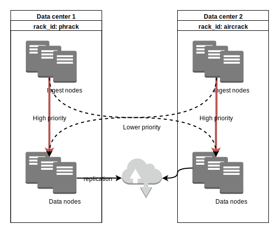
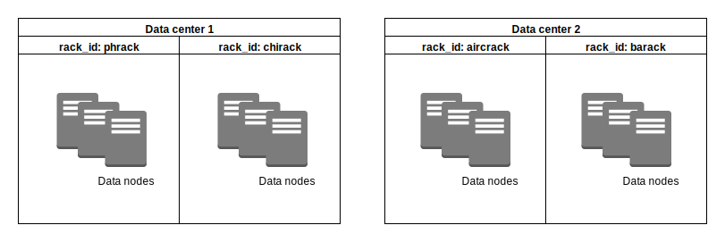
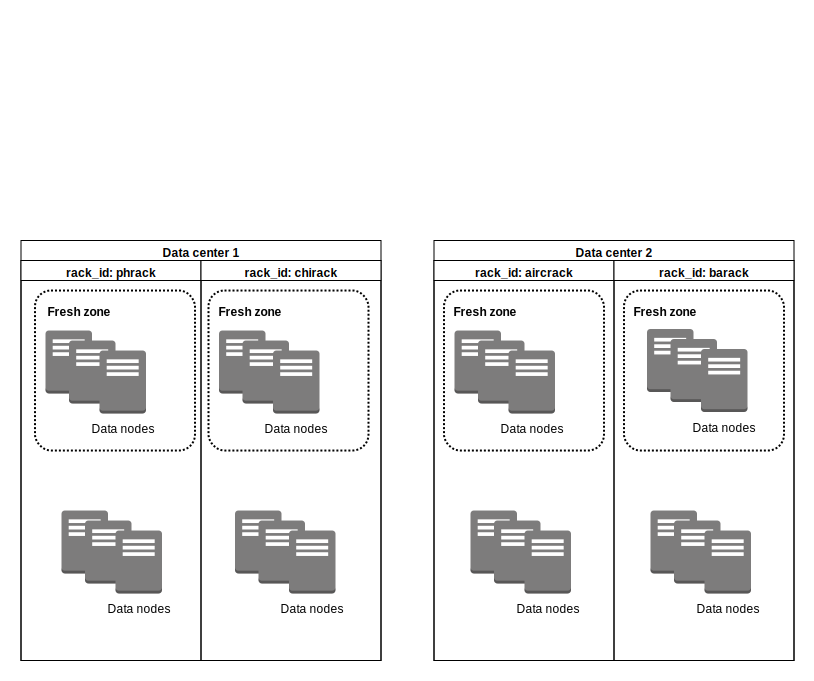
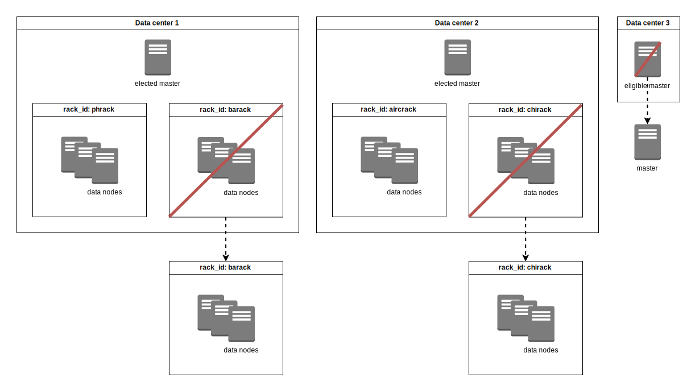

```
WIP, COVERS ELASTICSEARCH 5.5.x, UPDATING TO ES 6.5.x
```

# Migrating a 130TB Cluster from Elasticsearch 2 to 5 in 20 Hours with 0 Downtime and a Rollback Strategy

Do you remember [Blackhole, the 36 billion documents Elasticsearch cluster](https://thoughts.t37.net/how-we-reindexed-36-billions-documents-in-5-days-within-the-same-elasticsearch-cluster-cd9c054d1db8)we had to reindex a while ago? Blackhole is now a 130TB grownup with 100 billion documents, and my last task before I left Synthesio was migrating the little boy to Elasticsearch 5.1. This post is a more detailed version of the talk I gave November the 23rd at the ElasticFR meetup in Paris.

There were many reasons for upgrading Blackhole: feature, performances, better monitoring data exposed. But for me, the main reason to do it before I leave was **for the lulz**. I love running large clusters, whatever the software, I love [performing huge migrations](https://thoughts.t37.net/how-we-upgraded-a-22tb-mysql-cluster-from-5-6-to-5-7-in-9-months-cc41b391895d), and the bigger, the better.

---

## Elasticsearch @Synthesio, November 2017

At [Synthesio](https://www.synthesio.com/), we're using Elasticsearch pretty much everywhere as soon as we need hot storage. Cold storage is provided by MySQL and queuing by a bit more than 100TB of Apache Kafka.

There are 8 clusters running in production, with a bit more than 600 bare metal servers, with 1.7PB storage and 37.5TB RAM. Clusters are hosted in 3 data centers. One of them is dedicated to running each cluster third master host to avoid split brains when we lose a whole data center, which happens from time to time.

The servers are mostly 6 core, 12 threads Xeon E5--1650v3 with 64GB RAM and 4*800GB SSD or 2*1.2TB NVME, in RAID0. Some clusters have 12 core bi Xeon E5--2687Wv4 with 256GB RAM.

The average cluster stats are 85k writes / second, with 1.5M in peak, and 800 reads / second, some clusters having a continuous 25k search / second. Doc size varies from 150kB to 200MB.

---

## The Blackhole Cluster

Blackhole is a 77 nodes cluster, with 200TB storage, 4.8TB RAM, 2.4TB being allocated to Java, and 924 CPU core. It is made of 3 master nodes, 6 ingest nodes, and 68 data nodes. The cluster holds 1137 indices, with 13613 primary shards, and 1 replica, for 201 billion documents. It gets about 7000 new documents / second, with an average of 800 searches / second on the whole dataset.

Blackhole data nodes are spread between 2 data center. By using rack awareness, we make sure that each data center holds 100% of the data, for high availability. Ingest nodes are rack aware as well, to leverage Elasticsearch prioritising nodes within the same rack when running a query. This allows us to minimise the latency when running a query. A Haproxy controls both the ingest nodes health and proper load balancing amongst all of them.



Blackhole is feeding is a small part of a larger processing chain. After multiple enrichment and transformation, the data is pushed into a large Kafka queue. A working unit reads the Kafka queue and pushes the data into Blackhole.


This has many pros, the first one being to be able to replay a whole part of the process in case of error. The only con here is having enough disk space for the data retention, but in 2017 disk space is not a problem anymore, even on a 10s of TB scale.

---

## Migration Strategies: Cluster restart VS Reindex API VS Logstash VS the Fun Way

There are many ways to migrate an Elasticsearch cluster from a major version to another.

### The Cluster Restart Strategy

Elasticsearch regular upgrade path from 2.x to 5.x requires to close every index using the [`_close` API endpoint](https://www.elastic.co/guide/en/elasticsearch/reference/current/indices-open-close.html), upgrade the software version, start the nodes, then open the indexes again using the `_open` API endpoint.

Relying on the cluster restart strategy means keeping indexes created with Elasticsearch 2. This has no immediate consequence, except being unable to upgrade to Elasticsearch 6 without a full reindex. As this is something we do from time to time anyway, it was not a blocking problem.

On the cons side, the cluster restart strategy requires to shutdown the whole cluster for a while, which was not acceptable.

Someone once said there's a Chinese proverb for everything, and if it doesn't exist yet, you can make it a Chinese proverb anyway.

> When migration requires downtime, throwing more hardware solves all your problems.
> --- Traditional Chinese proverb.

Throwing hardware at our problems meant we could rely on 2 more migration strategies.

### The Reindex API Strategy

The first one is using [Elasticsearch reindex API](https://www.elastic.co/guide/en/elasticsearch/reference/6.0/docs-reindex.html). We have already used it to migrate some clusters from Elasticsearch 1.7 to 5.1. It has many cons though, so we decided not to use it this time.

Error handling is suboptimal, and an error on a bulk index means we will lose documents in the process without knowing it.

It is slow. Elasticsearch reindex API relies on scrolling, and [sliced scrolls](https://www.elastic.co/guide/en/elasticsearch/reference/current/search-request-scroll.html)are not available until version 6.0.

There's also another problem on live indexes. And a huge one: losing data consistency.

To ensure data consistency between the source and destination index, either you never update your data and it's OK, or you decide that all your indexes are write only during the whole reindexing, which implies an application downtime. Otherwise, you have a risk of race condition between your ongoing and the reindex process if the source cluster is updated before the destination cluster just when the data to update needs to be changed. The risk is small but still exists.

### The Logstash Strategy

We've been using Logstash a lot on Elasticsearch 1.7, as there was no reindex API yet. Logstash is faster than the reindex API, and you can use it inside a script which makes failure management easier.

Logstash has many cons as well, beside the race condition problem. The biggest one is that it is unreliable, and the risk of losing data in the process, without even noticing it, is too high. Logstash console output makes it difficult to troubleshoot errors as it is either too verbose or not enough.

### The Fun Way

The fun way mixes the Cluster Restart Strategy and throwing hardware at problems, with the con of being able to rollback anytime even after the migration is over. But I don't want to spoil you yet 😈.

---

## Migrating Blackhole for Real

The Blackhole migration took place on a warm, sunny Saturday. The birds were singing, the sun was shining, and the coffee was flowing in my cup.

Migration Prerequisites

Before starting the migration, we had a few prerequisites to fulfill:

* Making sure our mapping template compatibility with Elasticsearch 5.
* Using the [Elasticsearch Migration Helper](https://github.com/elastic/elasticsearch-migration/tree/2.x) plugin on Blackhole, just in case.
* Create the next 10 daily indexes, just in case we missed something with the mapping template.
* Telling our hosting provider that we would transfer more than 130TB on the network in the coming hours.

### Expanding Blackhole

The first migration step was throwing more hardware at blackhole.

We added 90 new servers, split in 2 data centers. Each server has a 6 core Xeon E5--1650v3 CPU, 64GB RAM, and 2 * 1.2TB NVME drives, setup as a RAID0. These servers were set up to use a dedicated network range as we planned to use them to replace the old Blackhole cluster and didn't want to mess with the existing IP addresses.

These servers were deployed with a Debian Stretch and Elasticsearch 2.3. We had some issues as Elasticsearch 2 systemd scripts don't work on Stretch, so we had to run the service manually. We configured Elasticsearch to use 2 new racks, Barack and Chirack. Then, we updated the replication factor to 3.


```bash
curl -XPUT "localhost:9200/*/_settings" -H 'Content-Type: application/json' -d '{
	"index" : {
		"number_of_replicas" : 3
	}
}
'
```

On the vanity metrics level, Blackhole had:

* 167 servers,
* 53626 shards,
* 279TB of data for 391TB of storage,
* 10,84TB RAM, 5.42TB being allocated to Java,
* 2004 core.


If you're wondering why we didn't decide to save time, only raising the replication factor to 2, then do it, lose a data node, enjoy, and read the basics of distributed systems before you want to run one in production.

Expanding Blackhole, we had to change a few dynamic settings for allocation and recoveries.

Blackhole initial settings were:

```yaml
cluster:
  routing:
    allocation:
      disk:
        threshold_enabled: true
        watermark:
          low: "78%"
          high: "79%"
      node_initial_primaries_recoveries: 50
      node_concurrent_recoveries: 20
      allow_rebalance": "always"
      cluster_concurrent_rebalance: 50
    rebalance.enable: "all"

indices:
  recovery:
    max_bytes_per_sec: "2048mb"
    concurrent_streams: 30
```

We decided to speed up the cluster recovery a bit, and disable the reallocation completely to avoid mixing both of them until the migration was over. To make sure the cluster would use as much disk space as possible without problems, we raised the watermark thresholds to the maximum.

```yaml
cluster:
  routing:
    allocation:
      disk:
        watermark.low : "98%"
        watermark.high : "99%"
    rebalance.enable: "none"

indices:
  recovery:
    max_bytes_per_sec: "4096mb"
    concurrent_streams: 50
```

Them Came the Problems

Transferring 130TB of data at up to 4Gb/s puts lots of pressure on the hardware.

The load on most machines was up to 40, with 99% of the CPU in use. Iowait went from 0 to 60% on most of our servers. As a result, Elasticsearch [bulk thread pool](https://www.elastic.co/guide/en/elasticsearch/reference/current/modules-threadpool.html) queue started to fill dangerously despite being configured to 4000, with a risk of rejected data.

Thankfully, there's a trick for that.

Elasticsearch provides a concept of zone, which can be combined with rack awareness for a better allocation granularity. For example, you can dedicate lot of hardware to the freshest, most frequently accessed content, less hardware to content accessed less frequently and even less hardware to content that is never accessed. Zones are configured on the host level.



We decided to create a zone that would only hold the data of the day, so the hardware would be less stressed by the migration.

To do it without rollbacking, we decided to disable the recovery, before we forced the indices allocation.

```bash
curl -XPUT "localhost:9200/_cluster/settings" -H 'Content-Type: application/json' -d '
{
    "transient" : {
		"cluster.routing.allocation.enable" : "none"
	}
}
'

curl -XPUT "localhost:9200/*/_settings" -H 'Content-Type: application/json' -d '
{
	"index.routing.allocation.exclude.zone" : "fresh"
}
'

curl -XPUT "localhot:9200/latest/_settings" -H 'Content-Type: application/json' -d '
{
	"index.routing.allocation.exclude.zone" : "",
	"index.routing.allocation.include.zone" : "fresh"
}
'
```

After a few minutes, the cluster was quiet and we were able to resume the migration.

```bash
curl -XPUT "localhost:9200/_cluster/settings" -H 'Content-Type: application/json' -d '
{
	"transient" : {
		"cluster.routing.allocation.enable" : "all"
	}
}'
```

Another way to do it is by playing with the `_ip` exclusion, but when you have more than 150 data nodes, it becomes a bit complicated. Also, you need to know that include and exclude are mutually exclusive, and can lead to some headache the first time you use them.

### Splitting Blackhole in 2

The next step of the migration was creating a full clone of Blackhole. To clone a cluster, all you need is:

* love
* a bunch of data node with 100% of the data
* a master node from the cluster to clone

Before doing anything, we disabled the shard allocation globally.

```bash
curl -XPUT "localhost:9200/_cluster/settings" -H 'Content-Type: application/json' -d '
{
	"transient" : {
		"cluster.routing.allocation.enable" : "none"
	}
}
'
```

Then, we shat down Elasticsearch on Barack, Chirack and one of the cluster master nodes.


Removing nodes to create a new Blackhole

Then, we reduced the replica number on Blackhole to 1, and enabled allocation.

```bash
curl -XPUT "localhost:9200/*/_settings" -H 'Content-Type: application/json' -d '
{
	"index" : {
		"number_of_replicas" : 1
	}
}'

curl -XPUT "localhost;9200/_cluster/settings" -H 'Content-Type: application/json' -d
'{
	"transient" : {
		"cluster.routing.allocation.enable" : "all"
	}
}
'
```

**The following step were performed with Elasticsearch being stopped on the removed hosts.**

We changed the excluded master node IP address to move it to a new Blackhole02 cluster network range, as well as the `discovery.zen.ping.unicast.hosts setting` so it was unable to talk to the old cluster anymore. We didn't change the cluster.name since we wanted to reuse all the existing information.

We also reconfigured the nodes within the Barack and Chirack racks to talk to that new master, then added 2 other fresh masters to respect the `discovery.zen.minimum_master_nodes: 2` settings.

Then, we started Elasticsearch first on the master taken from Blackhole, then on the 2 new master nodes. We had a new cluster without data nodes, but with all the index and shards information. This was done on purpose so we could close all the indexes without losing time with the data nodes being here, trying to reallocate or whatever.

We then closed all the existing indexes:

```bash
curl -XPUT "localhost:9200/*/_close"
```

It was time to upgrade Elasticsearch on that new Cluster. This was done in a few minutes running our [Ansible](https://ansible.org/) playbook.

We launched Elasticsearch on the master nodes first, to upgrade the cluster from 2 to 5. It took less than 20 seconds. I was shocked as I expected the process to take a few hours. Did I ever know, I would have asked for a maintenance window, but we would have lost the ability to rollback.

Then, we started the data nodes, enabled allocation again, and 30 minutes later, the cluster was green.

The last thing was to add a work unit to feed that Blackhole02 cluster and catch up with the data. This was made possible by saving the Kafka offset before we shut down the Barack and Chirack data nodes.

## Conclusion

The whole migration took less than 20 hours, including transferring 130TB of data on a dual data center setup.


The most important point here was that we were able to rollback at any time, including after the migration if something was wrong on the application level.

Deciding to double the cluster for a while was mostly a financial debate, but it had lots of pros, starting with the security it brought, as well as changing the whole hardware that had been running for 2 years.
